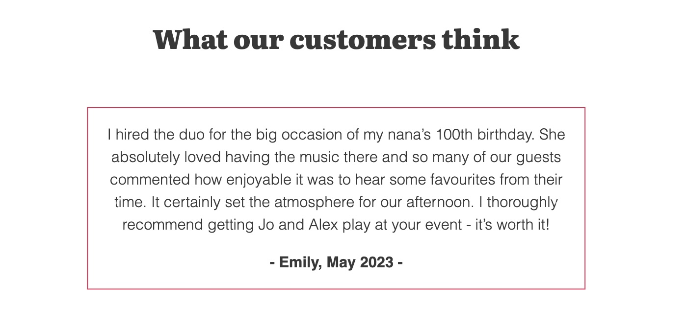

# The Selah Duo 

## Table of Contents
- [Introduction](#introduction)
- [User Experience](#user-experience)
- [Design](#design)
- [Features](#features)
- [Technologies Used](#technologies-used)
- [Testing](#testing)
- [Deployment](#deployment)
- [Credits](#credits)

## Introduction

**The Selah Duo** is a static front-end website for a violin and guitar jazz ensemble, who available for hire at various events. This project's primary goal is to increase engagement and brand awareness with the clients, in order to get more enquiries and event bookings. 

The website provides key information to potential clients including contact form for enquiries. A visitor will be able to listen to a sample audio file, engage with high quality pictures, see pricing packages and be directed to The Selah Duo's social media links. 

## User Experience

### User Stories 

- As a First Time Visitor, I want the website to be easily navigated through a simple and intuitive design, including responsive layout for different devices, so that I can find key information effectively.

- As a Potential Client, I want to see high-quality images and engaging description of duo’s services and experience, so that I can decide whether I'd like them to book them for my event.

- As an engaged couple, I'd like to listen to a recording of the ensemble to decide if I like their playing and want to choose them for my ceremony.

- As a party organiser, I'd like to send an enquiry message to the duo to ask about booking them for a birthday party and need to easily find a contact form.

- As an affiliate venue, I need to easily find contact details and links to social media to verify the ensemble's credibility.

- As a wedding planner, I want to easily access pricing information/packages to be able to pass this onto my clients.

- As a Prospective Customer, I want to read testimonials and reviews from other customers, so I can gauge the experiences of others and feel more confident about booking this music group for my event.

## Design

The design style chosen for the project is in modern, minimalist aesthetic in keeping with trends and 

### Website Structure 

The website consists of four pages: Home, Pricing, Enquiry page, which features the contact form and Thank you page where the visitor is directed to after the form is submitted. The Home page contains the bulk of the content with 4 different sections: Hero Landing Page, About Us, Media and Testimonies. The navbar and footer are in a fixed position, so they are both visable at all times.

### Colour Scheme 

The above colour palette, inspired by the photos featured on the website, is used throughout the project.

-  Jet (#383838) is the colour of majority of the text, as well as substitute background for sections where images are used. 
 
- White (#ffffff) is the default page background and features in sections where image is not used. It is also used for text on dark background, such as on the landing page and the enquiry form. 

- Amaranth (#e0144e) is the main accent colour, used for buttons, hyperlinks, hover function on icons and testimonies border. 

- Persian Orange (#cb9173) is the secondary accent colour and currently is only used in one instance - for hover function on hyperlinks. 

### Typography 

- 'Roboto' sans-serif Google font is used for the paragraph text throughout the website.
- 'Literata' serif Google font is used for the headings throguhout the website.
- Font Awesome icons have been used for social media links in the footer. 

## Features

- Landing Page 

The visitor is greeted by this landing page, which includes large hero image of the duo, one line description of what the website is about and the call to action, 'Enquire Now' button. The button directs to the Enquiry form. On the laptop view the navbar venue is clealry visable showing different pages of the side and the footer is drawing attention to the social media. 

- About Us

This section includes short biographies and profile pictures of both members of The Selah Duo - Alex and Joanna. It helps the new visitors and potential clients to know a bit about the professional experience of the musicisians and assures them the quality of service they provide. These features help to make the user feel like they have already been introduced and will give them more confidence to enquire with the duo, aiding future interactions. 

- Media

The Media section provides the user with an audio link to a promotional soundtrack of the duo. This enables them to sample the service provided and assess whether they are interested to pursue booking. 

- Testimonials

This section consists of an autoplay carousel, with each slide displaying a testimonial from a previous client. Having reviews from others can give potential customers assurance of their own satisfaction from purchase. The slide stops rotating when hovered over with the cursor (or stopped by finger on touchscreen devices), so that the visitor can read the testimonial at their leisure.  

- Pricing

The pricing information is featured on a dedicated page, so that the user can focus on familiarising themselves with the packages without being distracted by other sections of the page. Below the package information cards, the 'Enquire Now' button is included, so that the user can go striaght to the Enquiry form once they identify which package they're interested in.

- Enquire Form 

The Enquire Form on its dedicated page, allows the user to submit interest in booking a package or simply a question they have. 

- Thank You For Enquiring Page 

The user is redirected to Thank You page once they filled out the enquiry form to indicate that it has been sent succefully and the next steps of their enquiry. A button linking them to the Homepage has been provided.

### Future Features 

- Featured song list 

This would help the user to know what music to expect at their event and find out if they can play their favourites.

- Calendar availability

This would allow the client to see if the duo is available on the date of their event.

## Technologies Used

- [HTML5](https://en.wikipedia.org/wiki/HTML) was used for structure and content of the website.
- [CSS3](https://en.wikipedia.org/wiki/Cascading_Style_Sheets) was used for styling and layout.
- [Bootstrap](https://getbootstrap.com/) library was used for responsive layout and components, such as cards, carousel and navbar.
- [Google Fonts](https://fonts.google.com/specimen/Roboto) was used for all fonts on the website.
- [Font Awesome](https://fontawesome.com/icons) was used for the social media icons. 
- [Coolors](https://coolors.co/383838-e0144e-ffffff-cb9173) was used for generating a colour palette.
- [Canva](https://www.canva.com/) was used for creating a logo and resizing images.
- [Git](https://git-scm.com/) was used for version control through Gitpod terminal: git add ., git commit -m and git push.  
- [Git Hub](https://github.com/) was used for storing code after being pushed from Git.

## Testing

### HTML Validator

### CSS Validator

### Lighthouse Validator

- Homepage 

Desktop 

Mobile

- Pricing 

- Enquiry Form 

- Thank you 

### Bugs

## Deployment

The project is deployed on GitHub pages and can be accessed by the following link:
https://j-mlo.github.io/the-selah-duo/

## Credits

### Content 

All the written content on the webpage is original.

### Logo

- Designed by Alex Davis.

### Images

- 3 images on 'Pricing' page have been sourced and licenced by [Pexels](Pexels.com). 
- All other images belong to Joanna Davis.

### Audio

- Recording by The Selah Duo.

### Special Thanks 

Thank you to my mentor Spencer Bariball. 
